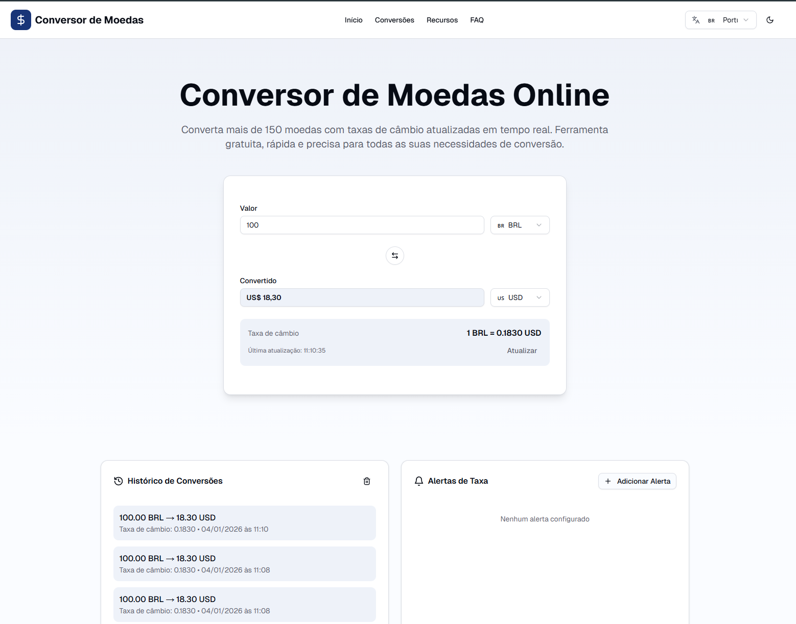
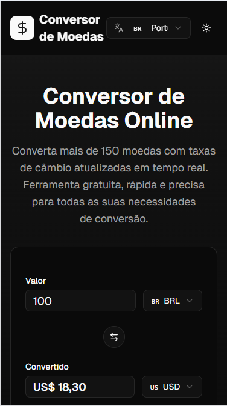

# Conversor de Moedas Online


Aplicação web para conversão de moedas em tempo real, desenvolvida com Next.js e TypeScript, com foco em performance, SEO e experiência do usuário.

🔗 **Aplicação em produção:**  
https://currency-converter-nu-livid.vercel.app/

## 🖥️📱 Preview da Aplicação

### 🖥️ Desktop




### 📱 Mobile




## 🚀 Características

### Funcionalidades Principais
- ✅ Conversão das moedas mais utilizadas no mercado global
- ✅ Taxas de câmbio atualizadas em tempo real via API
- ✅ Histórico de conversões (últimas 10 conversões)
- ✅ Gráfico de taxa de câmbio (últimos 7 dias)
- ✅ Alertas de taxa personalizáveis
- ✅ Modo offline (PWA - Progressive Web App)
- ✅ Botão de voltar ao topo
- ✅ Seletor de idiomas (PT, EN, ES)
- ✅ Tema claro/escuro com toggle

### Otimizações
- ✅ Interface responsiva e intuitiva
- ✅ SEO otimizado com metadata completa
- ✅ Schema.org estruturado para melhor indexação
- ✅ Google AdSense pronto para monetização
- ✅ Performance otimizada com Next.js 16
- ✅ Acessibilidade (WCAG 2.1)

## 📦 Tecnologias Utilizadas

- **Framework:** Next.js 16 (App Router)
- **Linguagem:** TypeScript
- **Estilização:** Tailwind CSS v4
- **Componentes UI:** shadcn/ui + Radix UI
- **Gráficos:** Recharts
- **API:** ExchangeRate-API (gratuita)
- **Analytics:** Vercel Analytics
- **Fontes:** Geist & Geist Mono
- **PWA:** Service Worker + Web Manifest

## 🛠️ Instalação

```bash
# Clone o repositório
git clone https://github.com/Rodrigopcosta/conversor-app.git

# Instale as dependências
npm install

# Execute em modo de desenvolvimento
npm run dev

# Build para produção
npm run build

# Inicie em produção
npm start
```

## 🌐 Estrutura do Projeto

```
├── app/
│   ├── layout.tsx                # Layout raiz com SEO e PWA
│   ├── page.tsx                  # Página principal
│   └── globals.css               # Estilos globais
├── components/
│   ├── currency-converter.tsx    # Conversor principal
│   ├── currency-select.tsx       # Seletor de moedas
│   ├── conversion-history.tsx    # Histórico de conversões
│   ├── exchange-rate-chart.tsx   # Gráfico de taxa de câmbio
│   ├── rate-alert.tsx            # Alertas de taxa
│   ├── theme-toggle.tsx          # Toggle de tema dark/light
│   ├── language-selector.tsx     # Seletor de idiomas
│   ├── back-to-top.tsx           # Botão voltar ao topo
│   ├── pwa-installer.tsx         # Instalador PWA
│   ├── header.tsx                # Cabeçalho
│   ├── footer.tsx                # Rodapé
│   ├── popular-conversions.tsx   # Conversões populares
│   ├── features-section.tsx      # Seção de recursos
│   ├── faq-section.tsx           # Perguntas frequentes
│   ├── adsense-slot.tsx          # Slots do AdSense
│   └── ui/                       # Componentes UI
├── public/
│   ├── manifest.json             # Web App Manifest
│   ├── sw.js                     # Service Worker
│   └── icon.png                  # Favicon
├── lib/
│   └── utils.ts                  # Utilitários
└── README.md                     # Este arquivo
```

## 🎯 Funcionalidades Detalhadas

### 1. Conversor de Moedas
- Conversão em tempo real
- Principais moedas mundiais
- Formatação automática de valores
- Troca rápida de moedas (swap button)
- Taxa de câmbio atualizada

### 2. Histórico de Conversões
- Salva últimas 10 conversões no localStorage
- Exibe data, hora e taxa de cada conversão
- Botão para limpar histórico
- Atualização automática

### 3. Gráfico de Taxa de Câmbio
- Visualização dos últimos 7 dias
- Gráfico interativo com Recharts
- Responsivo e acessível
- Cores adaptadas ao tema

### 4. Alertas de Taxa
- Crie alertas personalizados
- Notificações quando a taxa atingir o alvo
- Gerenciamento de múltiplos alertas
- Armazenamento local

### 5. Modo Offline (PWA)
- Instalável em dispositivos móveis
- Funciona offline após primeira visita
- Ícones e splash screens customizados
- Service Worker para cache inteligente

### 6. Tema Claro/Escuro
- Toggle no header
- Persistência da preferência
- Respeita preferência do sistema
- Transições suaves

### 7. Múltiplos Idiomas
- Português (padrão)
- Inglês
- Espanhol
- Fácil expansão para novos idiomas

### 8. Botão Voltar ao Topo
- Aparece após scroll
- Animação suave
- Posicionamento fixo
- Acessível via teclado

## 🎯 SEO e Otimizações

### Metadata Implementada

- ✅ Title e Description otimizados
- ✅ Keywords relevantes
- ✅ Open Graph (Facebook, LinkedIn)
- ✅ Twitter Cards
- ✅ Canonical URLs
- ✅ Robots.txt otimizado
- ✅ Schema.org (WebApplication)
- ✅ Viewport responsivo
- ✅ Web App Manifest

### Performance

- ✅ Server Components por padrão
- ✅ Lazy loading de componentes
- ✅ Otimização de imagens
- ✅ Code splitting automático
- ✅ Caching inteligente
- ✅ Service Worker para offline


## 🔑 API de Taxas de Câmbio

O projeto usa a **ExchangeRate-API** (gratuita):

```typescript
https://api.exchangerate-api.com/v4/latest/{MOEDA_BASE}
```


## ♿ Acessibilidade

- ✅ Navegação por teclado
- ✅ Screen reader friendly
- ✅ Contraste adequado (WCAG AA)
- ✅ ARIA labels e roles
- ✅ Texto semântico
- ✅ Focus visible
- ✅ Tamanho de toque adequado (44x44px)
- ✅ Zoom até 200% sem perda de funcionalidade


## 🎉 Recursos Adicionais

- [Documentação Next.js](https://nextjs.org/docs)
- [shadcn/ui](https://ui.shadcn.com)
- [Recharts](https://recharts.org)
- [Google AdSense](https://adsense.google.com)
- [PWA Builder](https://www.pwabuilder.com)
- [Service Worker API](https://developer.mozilla.org/en-US/docs/Web/API/Service_Worker_API)
- [Web App Manifest](https://developer.mozilla.org/en-US/docs/Web/Manifest)

## 👨‍💻 Autor

Desenvolvido por **Rodrigo Costa**

- 💼 LinkedIn: https://www.linkedin.com/in/rodrigopc-developer/
- 💻 GitHub: https://github.com/Rodrigopcosta

Projeto desenvolvido com foco em boas práticas de engenharia front-end, performance, SEO e experiência do usuário.

## 📄 Licença

Este projeto está licenciado sob a licença **MIT**.  
Consulte o arquivo [LICENSE](./LICENSE) para mais detalhes.


